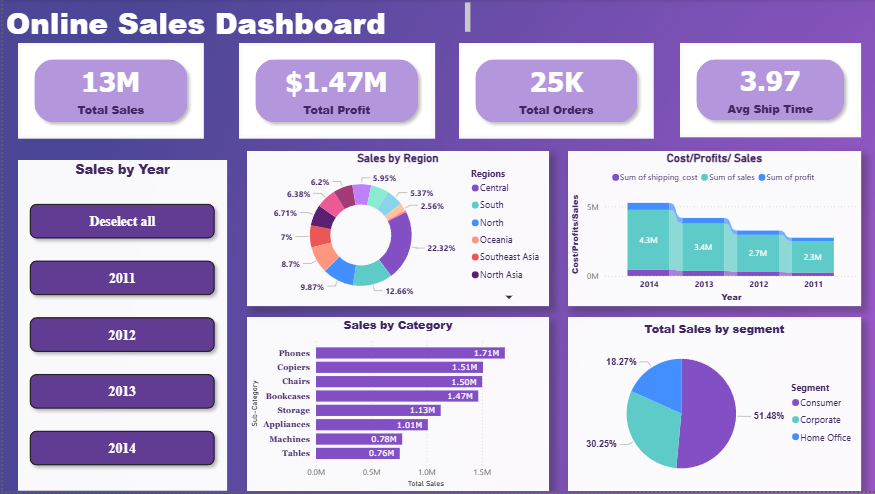

# Online Order Dashboard

**Interactive Power BI dashboard visualizing online orders, profits, sales, average shipping time, top products, and performance by region and segment.**  

This project demonstrates business intelligence and data analytics skills relevant for IT Analyst roles, including data modeling, visualization, and actionable reporting.

---

## Features

- **Total Orders & Profits** – Quick view of overall business performance  
- **Sales Overview** – Track revenue and growth trends  
- **Average Shipping Time** – Monitor operational efficiency  
- **Top 10 Products Sold** – Identify key revenue drivers  
- **Sales by Region** – Regional performance insights  
- **Sales by Segment** – Understand customer segmentation  

---

## Dashboard Preview

---

## File

- **Power BI Template (.pbit):** [Download here](files/OnlineOrderDashboard.pbit) *(requires Power BI Desktop)*  

---

## Tools & Skills Demonstrated

- Power BI Desktop & Service  
- Data modeling & DAX  
- Business intelligence reporting  
- Interactive data visualization  
- Analytical problem-solving  

---
## Repository Structure
